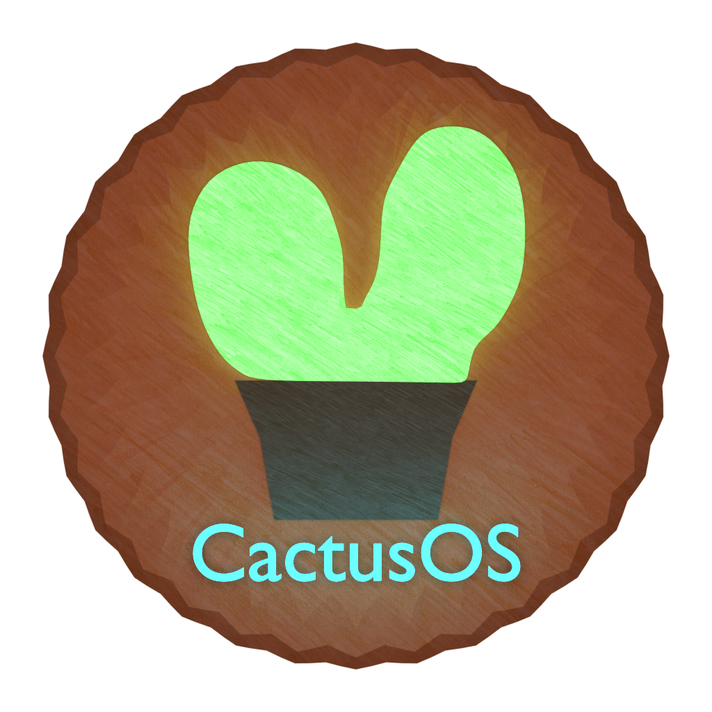

# CactusOS
CactusOS is a simple operating system that is aimed to not be anything like linux. I am just trying to build my own OS and definitely not the best one. It should run on every 32 bit emulator and pc but if it doesn't please let me know.

# Current Features
- Remake Core of CactusOS [Done]
- Higher Half Kernel [Done]
- Physical Memory Manager [Done]
- Virtual Memory Manager [Done]
- Paging [Done]
- PCI Device Enumeration [Done]
- SMBios Parsing [Done]
- Virtual 8086 Mode [Done]
- VESA Vbe after boot [Done]
- IDE support (ATA/ATAPI) [Done]
- ISO9660 filesystem [Basic]
- Multitasking [Basic]
- Usermode [Basic]
- Boot Screen [Done]
- Graphics Desktop [Basic]
- Applications
  - Calculator [Basic]
  - Clock [Basic]
  - Terminal [Basic]
  - Mine Game [Done]
- USB Support [Basic]
  - UHCI
  - OHCI
  - EHCI
  - xHCI Not supported yet

# Planned Features
- More complete custom build api for apps
- Some basic applications
  - File Manager
- GUI visual improvement, could look a whole lot better
  
# Building
To build CactusOS I recommend running a linux like environment, personaly I use ubuntu 4.15.0-47-generic.
A i686-elf cross compiler is also required, see [Osdev wiki](https://wiki.osdev.org/GCC_Cross-Compiler).
### Make build options
- ```make CactusOS.bin``` To build the binary
- ```make CactusOS.iso``` To build the cdrom image
- ```make clean``` To remove all the compiled files
- ```make qemu``` Build the CactusOS.iso file if necessary and then run the kernel using qemu

## Bochs
By default the os does not have graphics when running on bochs, to bypass this set the value BOCHS_GFX_HACK to 1 in kernel/include/system/system.h.

# Screenshots


